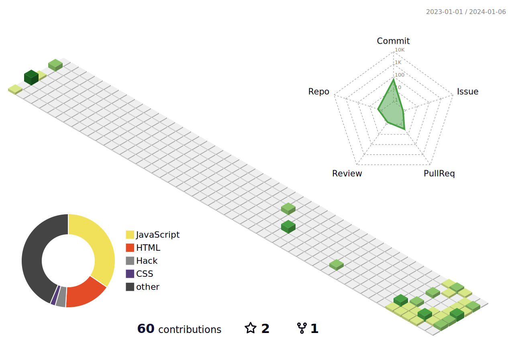

<h1 align="center"> 
  I am Filip    
  Full-stack developer and IT educator 
</h1> 

   
  
  
  
  
  
  

<h2>⚡️ A Few Quick Facts</h2>
<ul>
  <li>From Serbia</li>
  <li>Co-founder of  <a href="https://webfax.rs/">WebFax</a>.</li>
  <li>I'm a graduate in <b>Computer Science</b></li>
  <li> I don't focus on goals, I focus on the <b>systems</b> that lead to these goals</li>
  <li>Ask me about anything tech related, I am happy to help;</li>
  <li>Most of my projects are available on GttHub</li>
  <li> I’m currently learning <b>Webflow</b></li>
</ul>

  

  

 <h2>⚡️ I have experience with</h2>
  
 
 
 
  
 
 
 
 
 
 
 
 
 
 
 

  

 

