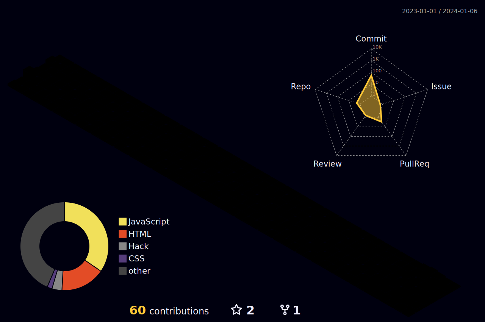

 

   
  
  
  
  
  

<h2>⚡️ A Few Quick Facts</h2>
<ul>
  <li>From Serbia</li>
  <li>Co-founder of  <a href="https://webfax.rs/">WebFax</a>.</li>
  <li>I'm a graduate in <b>Computer Science</b></li>
  <li> I don't focus on goals, I focus on the <b>systems</b> that lead to these goals</li>
  <li>Ask me about anything tech related, I am happy to help;</li>
</ul>

<h2 align="left" id="macropower-tech">Favorite Tech</h2>

> Tools, languages, and other things that I like to work with.

<table>
  <tr>
    <td align="center" width="96">
        
       HTML
    </td>
    <td align="center" width="96">
        
       CSS
    </td>
    <td align="center" width="96">
        
       Bootstrap
    </td>
    <td align="center" width="96">
        
       JavaScript
    </td>
      <td align="center" width="96">
        
       GitHub
    </td>
      <td align="center" width="96">
        
       Git
    </td>
      <td align="center" width="96">
        
       SCSS
    </td>
      <td align="center" width="96">
        
       Terminal
    </td>
      <td align="center" width="96">
        
       Wordpress
    </td>
        <td align="center" width="96">
        
       SQL
    </td>
        <td align="center" width="96">
        
       PHP
    </td>
        <td align="center" width="96">
        
       Slack
    </td>

  

 
  </tr>
</table>

<h2 align="left">GitHub stats</h2>

> Tools, languages, and other things that I like to work with.

</img>
</img>
</img>

 <!--  -->

